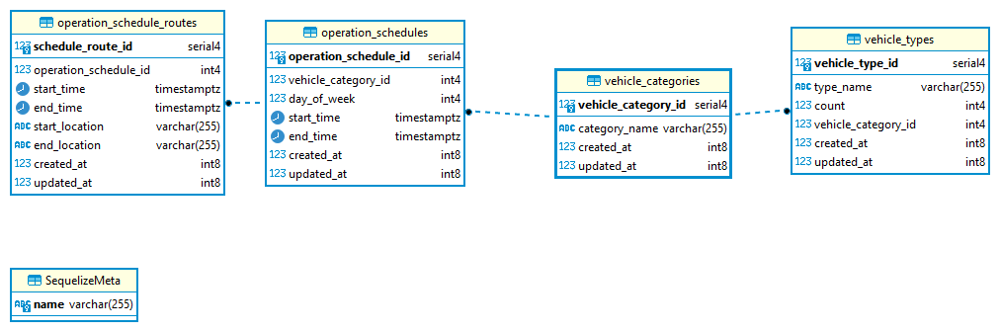

# WIOT Vehicle Operations API ⏲
WIOT API to schedule operational hours and routes for its vehicles.

## Development
For development Node.js v18 is required along with Docker for containerization to setup database.

1.  `yarn install`  to install dependencies in the repo
3.  `npm run start:dev`  to launch the API in development mode

## Database wiki
Go to docker API service shell using  `docker compose exec api sh`, and run the following as needed.

-   Create database:  `npx sequelize-cli db:create`
-   Run migrations:  `npx sequelize-cli db:migrate`
-   Seed data:  `npx sequelize-cli db:seed:all`

### ERD

## Launch using container
Run  `docker-compose up -d`  to setup everything, it will setup PostgreSQL on port 5433 and the API on port 3000.

## Demo
Log on to `http://localhost:3000/api` to view Swagger documentation and try it out.

## Note
This is just for a demo purpose and does not contain full features of a production grade application such as file logging (console logging available), distributed tracing, ssl support, and authentication. Some development level credentials are embedded for demo purpose, but the code supports environment variables.
